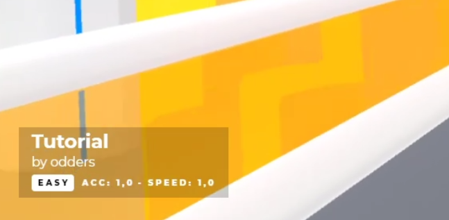
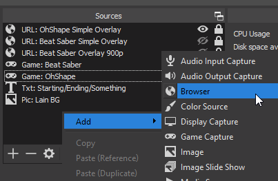
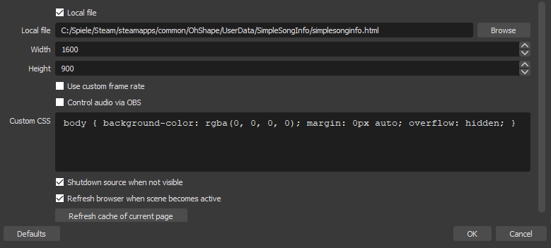

# OhShape - Simple Song Info
A mod for OhShape that outputs some data about the currently played songs that streamers can use to set up a stream overlay with song information.



## Download
Get the latest release from the [Project Releases](https://github.com/Shadnix-was-taken/OhShape-SimpleSongInfo/releases) page.

## Installation and usage with OBS
This mod requires MelonLoader in order work. You can find installation instructions and more information at:

- [MelonLoader Wiki](https://melonwiki.xyz/)
- [MelonLoader Github Repository](https://github.com/HerpDerpinstine/MelonLoader)

In order to install and use this mod:

1. Install MelonLoader (point it to your `OhShape.exe` file)
2. Start and quit OhShape once
3. Move the DLL file of this mod to your `OhShape\Mods\` directory.
4. Start and quit OhShape again
5. Create a browser source in OBS and point it to the new `OhShape\UserData\SimpleSongInfo\simplesonginfo.html` file





## Modifying the overlay
You can modify the stream overlay files that are being shipped with this mod by editing the template files that will get created after the first start in the `OhShape\UserData\SimpleSongInfo\` directory. You'll find two sets of files:

- `simplesonginfo-template-empty.html` and `simplesonginfo-template-empty.txt`
- `simplesonginfo-template-song.html` and `simplesonginfo-template-song.txt`

The contents of the `simplesonginfo-template-empty.*` files will get written to the corresponding `simplesonginfo.*` file on OhShape startup and while being in the menus.

The contents of the `simplesonginfo-template-song.*` files will get substituted and written to the corresponding `simplesonginfo.*` file while you are playing a song. The following parameters are available:

| Parameter | Description |
| - | - |
| %songauthor% | The author of the song |
| %songname% | The title of the song |
| %difficulty% | The difficulty being played |
| %accuracymultiplier% | The accuracy multiplier being played |
| %speedmultiplier% | The speed multiplier being played |
| %objectspeed% | The speed of the objects on the map being played |

## Developers

### Contributing to Simple Song Info
In order to build this project, you'll need to have OhShape and MelonLoader installed. In addition, please add a `SimpleSongInfo.csproj.user` file in the project directory and specify where your game is located on your disk:

```xml
<?xml version="1.0" encoding="utf-8"?>
<Project xmlns="http://schemas.microsoft.com/developer/msbuild/2003">
  <PropertyGroup>
    <!-- Change this path if necessary. Make sure it doesn't end with a backslash. -->
    <GameDirPath>C:\Program Files\Steam\steamapps\common\OhShape</GameDirPath>
  </PropertyGroup>
</Project>
```

## Credits
- The [MelonLoader Team](https://melonwiki.xyz/#/credits) for creating the mod loader
- [Reselim](https://github.com/Reselim/) - Creator of a [Beat Saber Overlay](https://github.com/Reselim/beat-saber-overlay) on which the example overlay shipped with this mod is based upon.
- [nate1280](https://github.com/nate1280/) - Creator of [Beat Saber SimpleSongOutput](https://github.com/nate1280/BeatSaber-SimpleSongOutput) - The mod that inspired this mod.

## Licensing
- This mod includes a modified version of the unnamed [Beat Saber Overlay](https://github.com/Reselim/beat-saber-overlay) by [Reselim](https://github.com/Reselim/) licensed unter the MIT License. See [LICENSE](https://github.com/Reselim/beat-saber-overlay/blob/master/LICENSE) for the full license.